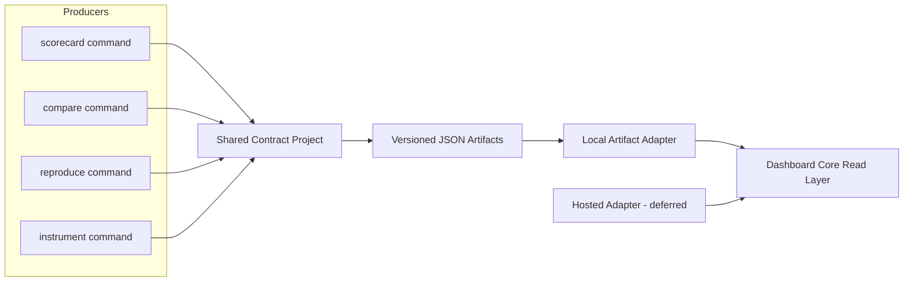
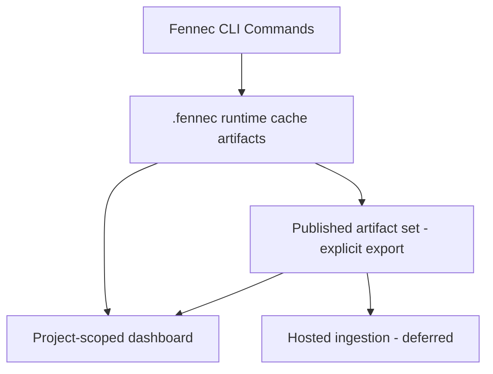

# Architecture Spine — Fennec.Labs Dashboard v1

## Design Paradigm

Contract-first artifact pipeline.

## Invariants & Rules

### AD-1 — Canonical dashboard data envelope

- **Binds:** shared-result-contract, dashboard-v1, all dashboard-consumed command outputs
- **Prevents:** command-specific parser drift and incompatible payload interpretation across consumers
- **Rule:** Every dashboard-consumed artifact MUST use a canonical envelope with `$schema`, `schemaVersion`, `command`, `producedAt`, `producerVersion`, `sourceContext`, and `payload`; command-specific fields live only inside `payload`.

### AD-2 — Flat-file-first v1 storage

- **Binds:** dashboard-v1 local mode
- **Prevents:** premature database coupling and operational overhead before query/load evidence exists
- **Rule:** V1 read path MUST consume JSON artifacts from filesystem storage; a database read-store is deferred and MUST NOT be required for v1 core functionality.

### AD-3 — Cache vs published artifact boundary

- **Binds:** artifact lifecycle and repo hygiene
- **Prevents:** repository bloat and stale cache data being treated as canonical history
- **Rule:** `.fennec/` remains runtime cache (gitignored). Commit-worthy artifacts MUST come from an explicit publish/export flow into a curated path with manifest metadata.

### AD-4 — Dedicated shared contract ownership

- **Binds:** code ownership boundaries
- **Prevents:** canonical schema drift caused by embedding contracts in individual command handlers
- **Rule:** Canonical envelope/payload contracts MUST be owned by a dedicated shared project (`FennecLabs.Contracts` name reserved); CLI writers and dashboard readers reference this shared project.

### AD-5 — Schema versioning governance

- **Binds:** all schema evolution in the shared contract
- **Prevents:** silent breaking changes for dashboard, hosted mode, and automation consumers
- **Rule:** Contract evolution follows SemVer: major for breaking changes, minor for additive changes, patch for corrective non-breaking changes; artifacts MUST declare `schemaVersion` and `$schema`.

### AD-6 — Mode-agnostic dashboard read layer

- **Binds:** local and future hosted dashboard modes
- **Prevents:** duplicated/forked dashboard logic per runtime mode
- **Rule:** Dashboard core reads a unified domain model through adapters; `LocalArtifactDataSource` is required for v1, and hosted data source implementations MUST preserve the same contract semantics.

### AD-7 — Upstream dependency tree normalization

- **Binds:** dependency graph ingestion from `dotnet`
- **Prevents:** unstable upstream shape changes leaking directly into canonical artifacts
- **Rule:** Dependency-tree collection MUST normalize upstream `dotnet package list --include-transitive --format json` output into canonical payload schema; when available, prefer fixed upstream output versioning (`--output-version 1`) to reduce source drift.



## Consistency Conventions

| Concern | Convention |
| --- | --- |
| Naming (entities, files, interfaces, events) | Envelope schema IDs follow `fennec.envelope.v{major}` and payload schemas follow `fennec.<command>.v{major}`; adapter interfaces are `*DataSource`; published artifact folders are deterministic and date/version-stamped. |
| Data & formats (ids, dates, error shapes, envelopes) | JSON property names are camelCase; timestamps are ISO-8601 UTC; top-level envelope always present; payload fields are command-scoped; error payloads use explicit typed error objects (no plain string-only failures). |
| State & cross-cutting (mutation, errors, logging, config, auth) | Artifacts are immutable once written; regeneration creates new artifact instances; command failures are represented in structured payload errors; local mode has no runtime auth boundary, hosted mode authz/authn is deferred but mandatory before production hosted rollout. |

## Stack

| Name | Version |
| --- | --- |
| .NET (all current projects) | 10.0 (`net10.0`) |
| System.Text.Json | In-box with .NET 10.0 |
| JSON Schema | Draft 2020-12 |
| ASP.NET Core Minimal APIs (hosted mode target, deferred) | 10.0 |

## Structural Seed



```text
src/
  FennecLabs.Cli/                    # command handlers, producers
  FennecLabs.Contracts/              # canonical envelope + payload contracts (new)
  FennecLabs.Dashboard/              # dashboard core + local adapter (new)
  FennecLabs.Dashboard.Web/          # optional browser host for local mode (new, deferred split)

_bmad-output/
  planning-artifacts/
    architecture/
    briefs/
    research/
```

## Capability → Architecture Map

| Capability / Area | Lives in | Governed by |
| --- | --- | --- |
| v1 transitive dependency tree + scorecard view | `FennecLabs.Dashboard` local adapter + view model pipeline; scorecard/dependency producers in `FennecLabs.Cli` | AD-1, AD-2, AD-4, AD-6, AD-7 |
| shared result contract for local now / hosted later | `FennecLabs.Contracts` + command payload schemas + envelope | AD-1, AD-4, AD-5 |

## Deferred

- Hosted API surface and auth model (OAuth/JWT scopes, tenant boundaries, API hardening profile).
- Database-backed read model introduction (SQLite/DuckDB/PostgreSQL) until measured query or scale thresholds require it.
- Full migration of non-v1 command views (instrumentation, compare, reproduce) into dashboard UX.
- Copilot-native canvas rendering path (after local dashboard pipeline is stable).
