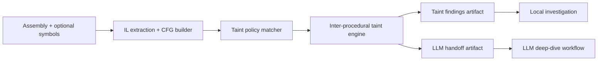
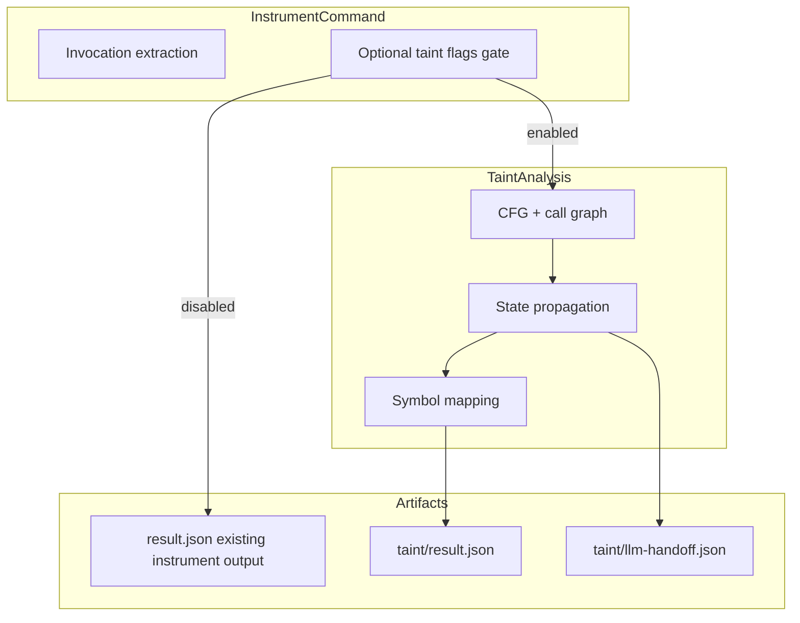

# Architecture Spine — Fennec.Labs Optional Taint Analysis v1

## Design Paradigm

Artifact-first static taint graph pipeline.

`instrument` remains the collection entrypoint; opt-in taint analysis derives deterministic graph artifacts from IL + symbols and emits machine contracts for downstream automation and LLM-assisted investigation.

## Inherited Invariants

| Inherited | From parent | Binds here |
| --- | --- | --- |
| AD-1 canonical dashboard data envelope | architecture-Fennec.Labs-2026-07-22 | Taint handoff artifacts intended for shared consumers must use canonical envelope semantics. |
| AD-3 cache vs published artifact boundary | architecture-Fennec.Labs-2026-07-22 | Taint outputs under `.fennec/` remain runtime cache and are not commit-worthy by default. |
| AD-5 schema versioning governance | architecture-Fennec.Labs-2026-07-22 | Taint artifact schema changes follow SemVer and explicit schema IDs/versions. |
| AD-6 mode-agnostic read layer | architecture-Fennec.Labs-2026-07-22 | Local taint generation must preserve a contract shape reusable by future hosted ingestion. |

## Invariants & Rules

### AD-1 — Optional execution gate on instrument

- **Binds:** instrument-opt-in-taint, all existing `instrument` users
- **Prevents:** accidental runtime/cost regressions and output changes for current workflows
- **Rule:** Taint analysis MUST execute only when explicit taint opt-in flags are provided; baseline `fennec instrument` behavior and output remain unchanged when taint flags are absent.

### AD-2 — Versioned taint taxonomy contract

- **Binds:** taint source/sink/propagator/sanitizer detection
- **Prevents:** heuristic drift and non-repeatable classifications between runs or environments
- **Rule:** Source, sink, propagator, and sanitizer definitions MUST come from a versioned policy contract (default policy + optional user policy override) with deterministic precedence and explicit `unknown` classification when no rule matches.

### AD-3 — Method-level CFG extraction as taint substrate

- **Binds:** control-flow reasoning, intra-procedural taint propagation
- **Prevents:** false chain reconstruction from raw call order alone
- **Rule:** For every analyzable method body, the analyzer MUST emit a normalized CFG representation (basic block nodes + directed edges + call-site anchors) that taint propagation consumes; methods without bodies are marked non-analyzable with reason codes.

### AD-4 — Inter-procedural call graph with explicit uncertainty

- **Binds:** call-chain context between source and sink
- **Prevents:** overstated confidence from unresolved dynamic dispatch/reflection edges
- **Rule:** Taint finding chains MUST be backed by an inter-procedural call graph that records resolved edges and unresolved edges separately; unresolved edges are retained as explicit uncertainty markers in findings.

### AD-5 — Taint state propagation semantics

- **Binds:** finding construction and severity/confidence assignment
- **Prevents:** incompatible local implementations of "tainted vs sanitized" logic
- **Rule:** Taint propagation MUST use canonical state transitions (`untainted`, `tainted`, `sanitized`, `unknown`) across parameter, return, field/property, and local flows; sanitizer transitions require explicit matching sanitizer policy entries.

### AD-6 — Symbol and source mapping fidelity contract

- **Binds:** developer-facing evidence and remediation workflow
- **Prevents:** unverifiable findings detached from source context
- **Rule:** Finding endpoints (source, sink, and intermediate chain hops where available) MUST carry symbol mapping metadata with fidelity levels (`exact`, `approximate`, `unresolved`) derived from PDB/portable PDB and sequence points; unresolved mapping is a first-class result, not a silent omission.

### AD-7 — LLM handoff artifact boundary

- **Binds:** downstream AI-assisted investigation
- **Prevents:** leaking oversized, unstructured, or ambiguous context into LLM prompts
- **Rule:** LLM handoff output MUST be a separate schema-governed artifact containing only normalized finding context (policy matches, call-chain slice, CFG snippets, source mapping, uncertainty flags, and provenance metadata), never raw full-assembly dumps.

### AD-8 — Output and cache location governance

- **Binds:** filesystem layout and cache lifecycle
- **Prevents:** path drift and collisions with existing instrument outputs
- **Rule:** Taint artifacts MUST write under `.fennec/instrument/.../taint/<timestamp-or-run-id>/` alongside existing instrument output hierarchy conventions; cache reuse keys include assembly identity, policy version hash, and analysis options, and `--no-cache` MUST bypass taint cache reuse.

### AD-9 — JSON artifact schema contract `[ADOPTED]`

- **Binds:** current consumers of `instrument --json` and file output
- **Prevents:** breaking downstream parsers expecting current flattened invocation schema
- **Rule:** Existing `instrument` JSON contracts remain backward-compatible by default; taint-enabled outputs are additive and versioned, with taint findings emitted in dedicated taint artifact payloads rather than shape-breaking mutation of current invocation records. JSON is the canonical machine-handoff format for all taint artifacts (`result.json`, `llm-handoff.json`, policy files). `[ADOPTED]`

### AD-10 — Performance and traversal-depth guardrails `[ADOPTED]`

- **Binds:** all taint traversal execution paths
- **Prevents:** unbounded analysis hang on large or adversarially complex assemblies, and poor UX in CI
- **Rule:** `[ADOPTED]` — Inter-procedural traversal MUST cap at `maxDepth` (default: **5** call levels; overridable via `--taint-max-depth`); any assembly exceeding 10,000 analyzable methods MUST warn and optionally bail; analysis MUST be cancellation-token-aware so `--no-cache` reruns and CI timeouts compose correctly; performance diagnostics (elapsed ms per phase, skipped method count, depth-cap hit count) MUST be emitted in taint findings diagnostics block.

### AD-11 — Full source and sink inventory export

- **Binds:** taint findings artifact, LLM handoff artifact
- **Prevents:** consumers seeing only matched pairs and missing blind-spot exposures or unmatched high-value sinks
- **Rule:** Both the `result.json` and `llm-handoff.json` MUST include complete inventories of every identified source and every identified sink present in the analyzed assembly, regardless of whether a source→sink path was found; findings represent confirmed paths; the inventory represents the full attack-surface exposure.

### AD-12 — Execution-context detection and classification

- **Binds:** analysis pipeline, policy application, artifact output
- **Prevents:** applying web-centric threat models to console tools, or process-injection models to pure web apps
- **Rule:** Before policy application, the analyzer MUST classify the assembly into one of the canonical execution contexts (`web-aspnet`, `worker-hosted-service`, `console`, `library`, `unknown`) using heuristics derived from assembly references, base type inheritance, and attribute presence; the detected context MUST be recorded in all taint artifacts.

### AD-13 — Context-bound rule catalogs and priority

- **Binds:** taint policy application, finding severity assignment
- **Prevents:** equal-priority application of irrelevant threat models creating noise that obscures real risk
- **Rule:** The taint policy MUST support per-context source/sink priority overrides; when a detected context is known, the engine MUST apply context-appropriate severity weights; a sink present in the assembly but irrelevant to the detected context MUST be downgraded to `low` or `informational`, not suppressed (to remain auditable).

### AD-14 — Capability fingerprinting and probability weighting

- **Binds:** finding confidence scores, LLM handoff context
- **Prevents:** high-severity findings for capabilities that demonstrably do not exist in the assembly (e.g., SSRF findings when no HTTP client is present)
- **Rule:** The analyzer MUST derive a capability fingerprint from observed call-site inventory (presence/absence of HTTP clients, file I/O, process launch, serialization, database access, queue/message bus); finding confidence MUST be down-weighted when required sink-side capabilities are absent from the fingerprint; the fingerprint MUST be included in both artifacts.

### AD-15 — DI abstraction resolution from binaries

- **Binds:** call graph construction, taint propagation, finding chain accuracy, LLM handoff
- **Prevents:** taint propagation halting at interface/abstract-type call edges, producing false negatives when sink is only reachable through the concrete implementation
- **Rule:** For DI-based assemblies the analyzer MUST attempt to resolve interface and abstract-type call edges to concrete implementation types using static evidence from the binaries and IL: `ServiceCollection` registration patterns (`AddSingleton<IFoo, FooImpl>`, `AddScoped`, `AddTransient`, `AddHostedService`), type-hierarchy scanning (all non-abstract types implementing the declared interface), and known hosting conventions (Minimal API handler delegates, typed `HttpClient` registrations). Each resolved call edge MUST record `declaredContractType`, `resolvedConcreteTypes[]`, `resolutionBasis`, and `resolutionConfidence`; edges that cannot be statically resolved MUST remain in the graph as `unresolved` with reason code rather than being dropped.

### AD-16 — Assembly ownership model via project-reference graph `[ADOPTED]`

- **Binds:** taint propagation scope, assembly inclusion/exclusion policy, artifact metadata
- **Prevents:** uncontrolled IL traversal of all transitive NuGet dependencies (exponential cost); inadvertent scanning of binaries the user does not own
- **Rule:** `[ADOPTED]` — Ownership is derived from the MSBuild project graph, not package-name heuristics:
  - **first-party** — the primary project(s) listed directly in the `.csproj`/`.sln`/`.slnx` input; IL always walked.
  - **second-party** — projects reached via transitive `<ProjectReference>` edges from the primary project(s), regardless of whether they are co-located in the same repository; IL walked by default.
  - **third-party** — assemblies arriving via `<PackageReference>` (NuGet packages); IL is NOT walked by default; their public APIs still appear as source/sink call targets via policy rules.
  The `--taint-second-party-prefix` flag (from AD-17) remains available as an override for orgs that consume internal packages via NuGet rather than project references. All three tiers and the classification reason MUST be recorded in the artifact `assemblyManifest` section.

### AD-17 — Input scope: `.csproj`, `.sln`, `.slnx`, `.dll`, `.nupkg` `[ADOPTED]`

- **Binds:** CLI entry points, build graph traversal, assembly collection
- **Prevents:** requiring users to manually enumerate assemblies for multi-project solutions; unintended inclusion of third-party IL without explicit opt-in
- **Rule:** `[ADOPTED]` — The analyzer MUST accept: a single `.csproj` (primary project + its transitive `<ProjectReference>` closure), a `.sln` (all solution projects + their P2P closure), a `.slnx` (same, XML-based format), a `.dll` (single assembly; ownership inferred from path), or a `.nupkg` (all contained DLLs treated as first-party — user is analyzing their own package). Third-party (`<PackageReference>`) IL traversal is opt-in via `--taint-include-third-party`; second-party identification via NuGet (for orgs using internal package feeds instead of project references) is configurable via repeatable `--taint-second-party-prefix <prefix>`.

## Acceptance Criteria Invariants

| ID | Area | Acceptance criterion |
| --- | --- | --- |
| AC-SS-1 | Source/sink detection | For a fixed assembly + policy version + options, source/sink/propagator/sanitizer classification is deterministic (byte-identical classification output across reruns). |
| AC-SS-2 | Source/sink detection | Unmatched APIs are explicitly labeled `unknown` with the policy lookup key that failed; no implicit default to source/sink/sanitizer. |
| AC-CFG-1 | CFG output | Every method marked analyzable includes at least one basic block, an entry block, and edge consistency (`from`/`to` block IDs must exist). |
| AC-CFG-2 | Call-chain output | Every reported source→sink finding includes at least one graph-validated path; any path segment crossing unresolved call edges is marked with `uncertain=true` and reason. |
| AC-SYM-1 | Symbol/source mapping | When matching PDB/portable PDB is available, source and sink endpoints include file path and line span with fidelity `exact` or `approximate`; unresolved mappings include explicit reason codes. |
| AC-SYM-2 | Symbol/source mapping | When no usable symbols exist, findings remain emitted with `fidelity=unresolved` and assembly/metadata token fallback references. |
| AC-PERF-1 | Performance guardrails | Analysis on a 10K-method assembly completes or produces a structured depth-cap warning within the configured timeout; never hangs silently. |
| AC-PERF-2 | Traversal depth cap | When traversal hits `maxDepth`, every affected finding records `depthCapHit=true` in its diagnostics and the artifact diagnostics block tallies the cap-hit count. |
| AC-INV-1 | Full inventory export | Both `result.json` and `llm-handoff.json` list every source and every sink identified in the assembly, including those with no confirmed path to a matching counterpart. |
| AC-CTX-1 | Context detection | Fixture assemblies for ASP.NET, HostedService/worker, and console contexts each produce `detectedContext` that matches their actual runtime context type; `library` is assigned only when no entrypoint context is detectable. |
| AC-CTX-2 | Context-bound severity | An SSRF-category finding against a console-app fixture that has no `HttpClient` reference produces severity `low` or `informational`, not `high`. |
| AC-CAP-1 | Capability fingerprinting | A fixture with no HTTP client call-site produces a capability fingerprint with `httpEgress=false`; any SSRF finding in that fixture carries `confidenceAdjusted=true` and a reduced confidence score vs. the same finding in an `httpEgress=true` assembly. |
| AC-DI-1 | DI registration discovery | For a fixture with `services.AddScoped<IUserService, UserService>()` in IL, the call graph records a resolved edge from the `IUserService` call-site to `UserService` with `resolutionBasis="di-registration"` and `resolutionConfidence` ≥ 0.9. |
| AC-DI-2 | Taint propagation through abstraction | A tainted value flowing through an `IUserService.ProcessInput(tainted)` call-site produces a finding with a path that includes the resolved concrete `UserService.ProcessInput` method, not just the interface edge. |
| AC-DI-3 | Unresolvable abstraction | A call-site targeting an interface with zero registered implementations records an `unresolved` edge with `resolutionBasis="type-hierarchy"` and `resolutionConfidence=0.0`; taint propagation is suspended at that edge with `uncertain=true`. |
| AC-OWN-1 | Single `.csproj` input | Running `instrument --taint MyApp.csproj` produces an `assemblyManifest` in `result.json` classifying the project's output assembly as `first-party`; all referenced NuGet package DLLs appear as `third-party` with `ilWalked=false`. |
| AC-OWN-2 | Solution multi-project input | Running `instrument --taint MyApp.sln` produces an `assemblyManifest` listing every solution project assembly as `first-party` with `ilWalked=true`; taint chains traverse P2P boundaries and findings correctly span multiple projects. |
| AC-OWN-3 | Third-party opt-in | With `--taint-include-third-party`: `third-party` assemblies gain `ilWalked=true`; without the flag the same assembly appears with `ilWalked=false` and taint propagation stops at the boundary (sink/source rules still match their public APIs). |

## Consistency Conventions

| Concern | Convention |
| --- | --- |
| Naming (entities, files, interfaces, events) | Contracts use `Taint*` prefixes (`TaintFinding`, `TaintPolicyRule`, `TaintCallEdge`); schema IDs follow `fennec.taint.<artifact>.v{major}`. |
| Data & formats (ids, dates, error shapes, envelopes) | IDs are deterministic and stable per finding (`sha256` over source/sink/policy/version/path signature); timestamps are ISO-8601 UTC; uncertainty and error conditions use typed reason codes. |
| State & cross-cutting (mutation, errors, logging, config, auth) | Analysis artifacts are immutable once written; unsupported IL or symbol states emit structured warnings/findings metadata, not silent drops; local mode has no auth boundary; hosted transport/auth remains deferred. |

## Stack

| Name | Version |
| --- | --- |
| .NET runtime | 10.0 (`net10.0`) |
| Mono.Cecil (IL + symbols) | 0.11.6 |
| System.CommandLine | 2.0.10 |
| System.Text.Json | In-box with .NET 10.0 |
| Portable PDB format | ECMA-335 Portable PDB |

## Structural Seed





```text
src/
  FennecLabs.Cli/
    Commands/InstrumentCommandHandler.cs         # opt-in taint flags + orchestration
  FennecLabs.Instrumentation/
    AnalyseAssembly.cs                           # existing invocation extraction baseline
  FennecLabs.TaintAnalysis/                      # new taint engine (cfg, call graph, policies, findings)
  FennecLabs.Contracts/
    Taint*.cs                                    # taint payload/handoff contracts
```

## Capability → Architecture Map

| Capability / Area | Lives in | Governed by |
| --- | --- | --- |
| Optional taint source/sink analysis | `FennecLabs.Cli` + `FennecLabs.TaintAnalysis` | AD-1, AD-2, AD-5 |
| Call-chain + CFG evidence generation | `FennecLabs.TaintAnalysis` | AD-3, AD-4, AC-CFG-1, AC-CFG-2 |
| Symbol/source correlation | `FennecLabs.TaintAnalysis` (symbol mapper) | AD-6, AC-SYM-1, AC-SYM-2 |
| LLM investigation handoff | `FennecLabs.Contracts` + taint artifact writers | AD-7, AD-9, inherited AD-1/AD-5 |
| Cache/output lifecycle | `FennecLabs.Cli` output orchestration | AD-8, inherited AD-3 |
| Performance and depth guardrails | `FennecLabs.TaintAnalysis` traversal engine | AD-10, AC-PERF-1, AC-PERF-2 |
| Full source/sink inventory export | `FennecLabs.TaintAnalysis` + artifact writers | AD-11, AC-INV-1 |
| Execution context detection | `FennecLabs.TaintAnalysis` context classifier | AD-12, AC-CTX-1 |
| Context-bound rule priority | `FennecLabs.TaintAnalysis` policy engine | AD-13, AC-CTX-2 |
| Capability fingerprinting | `FennecLabs.TaintAnalysis` fingerprint builder | AD-14, AC-CAP-1 |
| DI abstraction resolution | `FennecLabs.TaintAnalysis` DI resolver + call graph | AD-15, AC-DI-1, AC-DI-2, AC-DI-3 |
| Assembly ownership classification | `FennecLabs.TaintAnalysis` ownership classifier + build graph reader | AD-16, AD-17, AC-OWN-1, AC-OWN-2, AC-OWN-3 |
| Hosted-ready contract continuity | taint artifact schema and adapters | inherited AD-6, AD-7, AD-9 |

## Deferred

- Path-sensitive and context-sensitive flow precision tuning beyond baseline inter-procedural traversal.
- Full reflection/DI/runtime dispatch resolution (kept as explicit uncertainty until dedicated runtime-assisted analysis phase).
- Policy pack curation governance (industry presets, organization-specific policy registries, signed policy distribution).
- Hosted ingestion pipeline and tenant-aware storage/indexing for taint artifacts.
- Automated remediation suggestion generation beyond evidence packaging for LLM workflows.

## Open architecture questions (explicit — block epic creation if unresolved)

| ID | Question | Blocks |
| --- | --- | --- |
| OQ-13 | ~~**Traversal-depth default policy**~~ | **RESOLVED** — default `maxDepth=5`, overridable via `--taint-max-depth`. `[ADOPTED]` |
