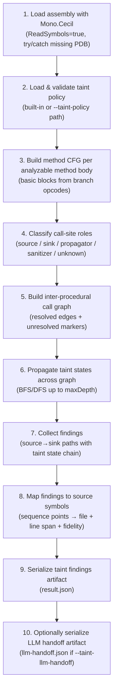

# Taint Analysis Companion — Implementation Guidance

> Updated: 2026-07-31 (pass 3 — context detection, capability fingerprinting, full inventory export). Companion to `ARCHITECTURE-SPINE.md`.

## Scope and baseline

This companion operationalizes `ARCHITECTURE-SPINE.md` for development execution. The selected primary UX direction is **opt-in taint flags on `fennec instrument`** with no behavior change when taint is not requested.

## Assumptions

- Existing `instrument` invocation extraction (Mono.Cecil, opcodes `Call`/`Callvirt`/`Calli`/`Newobj`/`Ldftn`/`Ldvirtftn`/`Jmp`) remains the baseline substrate and is not removed.
- Mono.Cecil symbol reading (`ReaderParameters { ReadSymbols = true }`) is the primary source-mapping mechanism; it reads Portable PDB embedded or co-located alongside the assembly.
- Taint analysis is static IL analysis only in v1 — no runtime tracing.
- Taint artifacts are ephemeral outputs under `.fennec/` unless later exported by an explicit publish flow per inherited AD-3.

---

## CLI UX surface (v1)

### Command surface

`fennec instrument` adds optional taint arguments, all backward-compatible when absent:

| Flag | Type | Default | Description |
| --- | --- | --- | --- |
| `--taint` | `bool` | `false` | Enable taint analysis for this run |
| `--taint-policy <path>` | `string?` | built-in v1 policy | Path to a custom policy JSON file |
| `--taint-max-depth <int>` | `int` | `5` | Inter-procedural traversal depth cap (default adopted: 5) |
| `--taint-llm-handoff` | `bool` | `false` | Also emit `llm-handoff.json` artifact |
| `--taint-timeout <seconds>` | `int` | `120` | Hard timeout; produces partial artifact + warning |
| `--taint-include-third-party` | `bool` | `false` | Walk IL of third-party NuGet assemblies (expensive; opt-in) |
| `--taint-second-party-prefix <prefix>` | `string[]` | `[]` | Repeatable. Package name prefix(es) treated as second-party (e.g. `MyOrg.`) |

Global behavior:

- Without `--taint`, behavior and output are byte-identical to current baseline.
- With `--taint`, instrument output still emits first; taint artifacts are additive under `.../taint/`.
- `--json` keeps existing invocation JSON contract; taint payload is separate artifacts only.
- `--no-cache` bypasses taint artifact reuse and forces recomputation.
- **Input scope:** the `<assembly-or-project>` positional argument now accepts a `.csproj` (single project + P2P refs), a `.sln` (all solution projects + P2P refs), or a `.slnx` (same) in addition to `.dll`/`.nupkg`. When a project file is given, `dotnet build` produces the build outputs; for `.dll` inputs ownership classification falls back to heuristics (see Ownership model section).

---

## Output layout and cache behavior

### Filesystem layout

```text
.fennec/
  instrument/
    <assembly-name>/          # local .dll mode
      <filename>.fxt or .json   # existing invocation output
      taint/
        <run-id>/
          result.json             # taint findings
          llm-handoff.json        # only when --taint-llm-handoff
    <package-id>/             # NuGet mode
      <version>/
        lib/<tfm>/<dll>.fxt or .json
        taint/
          <run-id>/
            result.json
            llm-handoff.json
```

`<run-id>` is a deterministic hex string: `sha256(<assembly-identity> + <policy-version> + <options-fingerprint>)[:12]`, providing stable cache keys. Cache hit = file exists at that path; `--no-cache` removes and regenerates.

### Cache key composition

```
assembly-identity = assembly-name + "/" + assembly-version + "/" + mvid-guid
policy-version    = policy-schema-version + "/" + sha256(policy-file-content)[:8]
options-fp        = max-depth + "/" + (llm-handoff ? "1" : "0")
```

---

## Taint model: sources, sinks, propagation, sanitizers

### Taint state machine

Each tracked value (parameter, local variable, return value, field read) carries one of four states:

| State | Meaning |
| --- | --- |
| `untainted` | Value has no taint origin |
| `tainted` | Value flows from a source or carries taint from a tainted input |
| `sanitized` | Value was previously tainted but passed through a recognized sanitizer |
| `unknown` | No policy match; state cannot be determined |

Transitions are recorded in findings as ordered state lists so LLM consumers can reason about the full flow.

### Propagation rules (v1)

| IL pattern | Rule |
| --- | --- |
| Method call where callee is a **source** | Return value → `tainted` |
| Method call where callee is a **sink** | Any `tainted` argument → finding emitted |
| Method call where callee is a **propagator** | If any argument is `tainted`, return value → `tainted` |
| Method call where callee is a **sanitizer** | All `tainted` arguments in its output → `sanitized` |
| Assignment (`stloc`, `stfld`, `starg`) | Taint transfers to destination |
| Field or property read (`ldfld`, `ldarg`) | Taint of destination is taint of source |

v1 does **not** track index-into-collection or arithmetic narrowing; those are `unknown` propagations.

### Policy format (versioned JSON)

Location: embedded as `FennecLabs.TaintAnalysis/Resources/taint-policy.v1.json` for default; user override specified via `--taint-policy <path>`.

```json
{
  "$schema": "fennec.taint.policy.v1",
  "schemaVersion": "1.0.0",
  "policyId": "default-v1",
  "rules": [
    {
      "id": "src-http-query",
      "kind": "source",
      "assembly": "System.Web",
      "typeName": "System.Web.HttpRequest",
      "memberName": "get_QueryString",
      "category": "network-input",
      "confidence": 1.0,
      "description": "HTTP query string — user-controlled input"
    },
    {
      "id": "src-env-var",
      "kind": "source",
      "assembly": "System.Runtime",
      "typeName": "System.Environment",
      "memberName": "GetEnvironmentVariable",
      "category": "environment",
      "confidence": 0.9,
      "description": "Environment variable — potentially attacker-influenced in some threat models"
    },
    {
      "id": "snk-sql-cmd",
      "kind": "sink",
      "assembly": "System.Data",
      "typeName": "System.Data.SqlClient.SqlCommand",
      "memberName": ".ctor",
      "argIndices": [0],
      "category": "sql-injection",
      "severity": "high",
      "description": "SQL command constructor — tainted first argument is SQL injection"
    },
    {
      "id": "snk-process-start",
      "kind": "sink",
      "assembly": "System.Diagnostics.Process",
      "typeName": "System.Diagnostics.Process",
      "memberName": "Start",
      "argIndices": [0],
      "category": "command-injection",
      "severity": "critical",
      "description": "Process.Start with user-controlled path or argument"
    },
    {
      "id": "san-html-encode",
      "kind": "sanitizer",
      "assembly": "System.Web",
      "typeName": "System.Web.HttpUtility",
      "memberName": "HtmlEncode",
      "description": "HTML-encodes output, removes XSS risk"
    },
    {
      "id": "prop-string-format",
      "kind": "propagator",
      "assembly": "System.Runtime",
      "typeName": "System.String",
      "memberName": "Format",
      "description": "String.Format propagates taint from any format argument"
    }
  ]
}
```

**Rule resolution logic**: match on (`assembly`, `typeName`, `memberName`) case-insensitively; for sinks `argIndices` restricts which argument positions trigger a finding (empty = any argument). User policy file rules are merged with default rules; when a user rule has the same `id` it replaces the default entry; otherwise it appends. Unmatched calls produce classification `unknown` with the attempted lookup key in diagnostics.

### Default v1 source categories (scope to validate with product/security)

| Category | Example APIs |
| --- | --- |
| `network-input` | `HttpRequest.QueryString`, `HttpRequest.Form`, `HttpRequest.Headers`, `HttpContext.Request.Body` |
| `file-input` | `File.ReadAllText`, `StreamReader.ReadToEnd`, `File.OpenRead` |
| `environment` | `Environment.GetEnvironmentVariable`, `Environment.GetCommandLineArgs` |
| `deserialization` | `JsonSerializer.Deserialize<T>`, `XmlSerializer.Deserialize`, `BinaryFormatter.Deserialize` |
| `database-read` | `SqlDataReader.GetString`, `DbDataReader[]` indexer |

### Default v1 sink categories (scope to validate with product/security)

| Category | Example APIs |
| --- | --- |
| `sql-injection` | `SqlCommand.ctor`, `DbCommand.CommandText` setter |
| `command-injection` | `Process.Start`, `ProcessStartInfo.FileName` setter |
| `path-traversal` | `File.Open`, `File.ReadAllText`, `Directory.GetFiles` |
| `xss` | `HttpResponse.Write`, `HtmlTextWriter.Write` |
| `ssrf` | `HttpClient.GetAsync`, `WebClient.DownloadString` |
| `log-injection` | `ILogger.Log*`, `Console.Write*` (low severity) |

---

## Analysis pipeline (concrete steps)



### Step 3 — CFG construction (Mono.Cecil approach)

A basic block boundary occurs at: any branch opcode (`br`, `brtrue`, `brfalse`, `beq`, `bge`, `ble`, `blt`, `bgt`, `bne`, `switch`), any exception handler entry/exit, and any label that is the target of a branch. Algorithm:

```text
For each MethodDefinition where HasBody == true:
  instructions = method.Body.Instructions
  find all branch targets → block-start set
  build blocks: each block = [ first_instr .. last_instr_before_next_start ]
  edges: unconditional branch → single successor; conditional branch → two successors
  call-site anchors: instructions with Call/Callvirt/Newobj → record offset + callee MethodReference
```

CFG nodes carry an array of instruction offsets and the call-site metadata list; edges carry `kind` = `unconditional | true-branch | false-branch | exceptional`.

### Step 5 — Call graph construction (with DI abstraction resolution)

Resolved edge: callee `MethodReference` resolves to a `MethodDefinition` present in loaded modules.  
Unresolved edge: callee is external (no `MethodDefinition`), virtual without a resolved override, or a delegate/reflection target.

```text
For each resolved call site in a CFG:
  if callee.MethodDefinition != null → add directed edge (caller, callee)
  if callee is virtual → attempt devirtualization from type hierarchy; if ambiguous → unresolved
  if callee is via delegate / Ldftn → unresolved (record opcode context)
```

**DI abstraction resolution** runs immediately after the base call graph is built and enriches every edge whose callee is an interface or abstract type:

```text
DI resolution priority order (highest confidence first):
  1. di-registration:    Scan all loaded method bodies for call sequences matching
                          IServiceCollection.AddSingleton/AddScoped/AddTransient/AddHostedService
                          generic or non-generic variants.  Extract (serviceType, implementationType).
                          When found: edge.resolutionBasis = "di-registration", resolutionConfidence ≥ 0.90.
  2. known-hosting:      Map Minimal API MapGet/MapPost/MapPut/MapDelete delegate parameters to
                          registered services; typed HttpClient IHttpClientFactory<T> → HttpClient.
                          resolutionBasis = "known-hosting", resolutionConfidence ≈ 0.85.
  3. type-hierarchy:     Scan all loaded TypeDefinitions implementing the interface or inheriting
                          the abstract type.  If exactly one non-abstract concrete type found:
                          resolutionBasis = "type-hierarchy-unique", resolutionConfidence = 0.75.
                          If multiple: resolutionBasis = "type-hierarchy-ambiguous", resolutionConfidence = 0.40,
                          resolvedConcreteTypes contains all candidates.
  4. unresolved:         No concrete type found.  Edge retained with resolutionBasis = "none",
                         resolutionConfidence = 0.0, taint suspended at this edge with uncertain=true.
```

**Call edge schema** (extends existing call graph edge):

```jsonc
{
  "from": "MyApp.Api.Controllers.UserController::Get",
  "to": "MyApp.Services.IUserService::ProcessInput",       // declared contract
  "abstractionEdge": true,
  "declaredContractType": "MyApp.Services.IUserService",
  "resolvedConcreteTypes": ["MyApp.Services.UserService"],
  "resolutionBasis": "di-registration",                    // or known-hosting | type-hierarchy-unique | type-hierarchy-ambiguous | none
  "resolutionConfidence": 0.92,
  "resolvedEdges": [
    { "to": "MyApp.Services.UserService::ProcessInput", "resolutionConfidence": 0.92 }
  ]
}
```

### Step 6 — Taint propagation

Traversal: breadth-first from each source node, up to `maxDepth` levels of inter-procedural edges.  
Intra-procedural: forwards data-flow through CFG block sequence; simple parameter-to-return tracking.  
When the depth cap is hit: mark all open paths as `uncertain=true, depthCapHit=true`.

---

## Source/symbol correlation via Mono.Cecil

### Loading symbols

```csharp
// Preferred: portable PDB embedded in assembly or co-located .pdb file
var readerParams = new ReaderParameters
{
    ReadSymbols = true,
    SymbolReaderProvider = new PdbReaderProvider(),    // handles both Windows PDB and Portable PDB
    ThrowIfSymbolsAreNotMatching = false,             // degrade gracefully
};
try
{
    var asm = AssemblyDefinition.ReadAssembly(path, readerParams);
    // asm.MainModule.HasSymbols == true when symbols loaded
}
catch (SymbolsNotFoundException)
{
    // Reload without symbols; all mappings → fidelity=unresolved
}
```

### Mapping an instruction to source location

```csharp
// For a call-site instruction at a given method body:
SequencePoint? sp = method.DebugInformation?.GetSequencePoint(instruction);
if (sp is { IsHidden: false })
{
    // fidelity=exact: exact line from PDB sequence point
    sourceRef = new SourceRef(sp.Document.Url, sp.StartLine, sp.StartColumn, sp.EndLine, sp.EndColumn, "exact");
}
else if (method.DebugInformation?.SequencePoints.Count > 0)
{
    // approximate: nearest preceding non-hidden sequence point
    // Walk backwards through instructions until one has a non-hidden sequence point
    sourceRef = new SourceRef(nearestSp.Document.Url, nearestSp.StartLine, 0, nearestSp.StartLine, 0, "approximate");
}
else
{
    // unresolved: no PDB or only hidden sequence points
    sourceRef = new SourceRef(null, 0, 0, 0, 0, "unresolved",
        reason: "no-pdb | hidden-sequence-points",
        metadataToken: instruction.Operand is MethodReference mr ? mr.MetadataToken.ToInt32() : 0);
}
```

### Fidelity levels

| Fidelity | When | What is included |
| --- | --- | --- |
| `exact` | Non-hidden sequence point on the instruction | `file`, `startLine`, `startCol`, `endLine`, `endCol` |
| `approximate` | Nearest preceding non-hidden sequence point | `file`, `startLine`; columns omitted; `approximate=true` |
| `unresolved` | No symbols or only hidden points | `reason`, `metadataToken` (fallback for debugger attachment); file/line omitted |

---

## Input scope and assembly ownership model (AD-16, AD-17)

### Input forms and build graph traversal

| Input | Traversal strategy |
|---|---|
| `.csproj` | Load project; enumerate all transitive project-to-project (`<ProjectReference>`) outputs; collect all NuGet package assemblies from build output |
| `.sln` | Parse solution for all `Project(...)` entries; union of each project's P2P closure and NuGet package refs |
| `.slnx` | Same as `.sln`; XML-based format (Visual Studio 17.x+); parsed via `Microsoft.Build` or regex-based reader |
| `.dll` | Single assembly; ownership tier inferred from file path (under `packages/` cache → third-party; otherwise first-party heuristic) |
| `.nupkg` | All DLLs inside the package → first-party (user is analyzing their own package) |

Build resolution strategy: invoke `dotnet build --no-restore --getProperty:OutputPath` per project to locate build outputs; fall back to scanning known output directories (`bin/Debug/net*/`, `bin/Release/net*/`) if MSBuild evaluation unavailable.

### Three-tier ownership classification

The authoritative ownership source is the **MSBuild project graph**, not package-name heuristics:

```text
Ownership decision order:
  1. first-party:   assembly is the build output of a project listed directly
                    in the .csproj / .sln / .slnx input.
  2. second-party:  assembly is the build output of a project reached via
                    transitive <ProjectReference> edges from a first-party project.
                    (These are project-reference dependencies — same org, different repo.)
  3. third-party:   assembly arrives via <PackageReference> (NuGet).

Override for NuGet-distributed internal packages:
  --taint-second-party-prefix <prefix>  promotes matching PackageReference
  assemblies from third-party to second-party (IL walked by default).

For .dll / .nupkg inputs without MSBuild context:
  - .nupkg → all contained DLLs classified first-party (user is analyzing their own package)
  - .dll path contains /packages/ or /.nuget/ → third-party
  - .dll path under project bin/ → first-party
  - otherwise → third-party (conservative default)
```

### IL walking rules per tier

| Tier | IL walked by default | Opt-in flag | Source/sink policy rules still apply |
|---|---|---|---|
| first-party | ✅ always | — | ✅ |
| second-party | ✅ by default | `--taint-second-party-prefix` controls scope | ✅ |
| third-party | ❌ default | `--taint-include-third-party` | ✅ (public API call-sites matched as sources/sinks) |

When taint propagation hits a third-party assembly boundary without `--taint-include-third-party`:
- Record the boundary call-site in `assemblyManifest` as `boundaryStop=true`
- Emit the partial chain up to the boundary in findings with `propagationStopped=true, propagationStopReason="third-party-boundary"`
- Third-party sinks/sources still produce findings when a first/second-party method calls them directly

### Assembly manifest artifact schema (in `result.json` payload)

```jsonc
"assemblyManifest": [
  {
    "name": "MyApp.dll",
    "version": "1.0.0.0",
    "ownershipTier": "first-party",  // "first-party" | "second-party" | "third-party"
    "classificationReason": "direct-project-output",  // "direct-project-output" | "project-reference-transitive" | "nuget-second-party-prefix" | "nuget-package-cache" | "bin-path-heuristic" | "nupkg-input"
    "ilWalked": true,
    "methodCount": 840,
    "pdbPresent": true
  },
  {
    "name": "MyOrg.SharedLibrary.dll",
    "version": "2.3.1.0",
    "ownershipTier": "second-party",
    "classificationReason": "project-reference-transitive",
    "ilWalked": true,
    "methodCount": 210,
    "pdbPresent": false
  },
  {
    "name": "Newtonsoft.Json.dll",
    "version": "13.0.3.0",
    "ownershipTier": "third-party",
    "classificationReason": "nuget-package-cache",
    "ilWalked": false,
    "policyRulesApplied": ["src-json-deserialize"]
  }
]
```

`diagnostics` gains two new counters: `assembliesWalked` (int) and `assembliesBoundarySkipped` (int).

---

## Execution context detection (AD-12)

### Canonical context types

| Context | Identifier | Description |
| --- | --- | --- |
| ASP.NET / web | `web-aspnet` | Assembly references `Microsoft.AspNetCore.*` or `System.Web`, or contains controllers/middleware |
| Hosted worker | `worker-hosted-service` | Implements `IHostedService` / `BackgroundService`, or references `Microsoft.Extensions.Hosting` without web stack |
| Pure console | `console` | `OutputType=Exe` assembly with no web/hosting references and no `IHostedService` implementations |
| Library | `library` | No entrypoint context; all above are absent |
| Unknown | `unknown` | Insufficient evidence to classify |

### Detection heuristics (applied in priority order)

```
1. Assembly-level reference scan:
   - References contain "Microsoft.AspNetCore" → web-aspnet
   - References contain "System.Web" → web-aspnet
   - References contain "Microsoft.Extensions.Hosting" (without web) → worker-hosted-service

2. Type-level base-class / interface scan:
   - Any type inherits BackgroundService → worker-hosted-service
   - Any type implements IHostedService → worker-hosted-service
   - Any type inherits ControllerBase or Controller → web-aspnet (reinforce)
   - Any type has [ApiController] attribute → web-aspnet (reinforce)

3. Entry-point check:
   - Module has no entry point → library
   - Module has entry point + none of above matched → console

4. Confidence: each signal adds to a weighted score; highest-scoring context wins.
   Ties broken in favour of web-aspnet > worker-hosted-service > console > library.
```

---

## Context-aware source/sink catalogs (AD-13)

### Context → threat model → source/sink priority

#### `web-aspnet` context

| Priority | Category | Typical sources | Typical sinks |
| --- | --- | --- | --- |
| Critical | XSS | `HttpRequest.QueryString`, `.Form`, `.Headers`, `.Body` | `HttpResponse.Write`, `HtmlTextWriter.Write`, Razor output without encode |
| Critical | SQL injection | Request-derived strings | `SqlCommand.ctor`, `DbCommand.CommandText` setter |
| High | SSRF | `HttpRequest` route/query params | `HttpClient.GetAsync/PostAsync`, `WebClient.DownloadString`, `WebRequest.Create` |
| High | Path traversal | Request params | `File.Open`, `Directory.GetFiles`, `Path.Combine` (when fed to file API) |
| Medium | Log injection | Any request input | `ILogger.Log*`, `Console.Write*` |
| Low | Command injection | Request params | `Process.Start` (rare in web apps; retain but downgrade) |

#### `worker-hosted-service` context

| Priority | Category | Typical sources | Typical sinks |
| --- | --- | --- | --- |
| Critical | Command injection (confused deputy) | Environment variables, config, queue message payloads | `Process.Start`, `ProcessStartInfo.FileName` setter |
| Critical | Path traversal | Config-derived paths, message payloads | `File.Open`, `File.Delete`, `Directory.Delete` |
| High | Privilege escalation via deserialization | Queue/bus message deserialize | `JsonSerializer.Deserialize<T>`, `BinaryFormatter.Deserialize` |
| High | SQL injection | Message payload strings | `SqlCommand.ctor` |
| Medium | SSRF | External config/queue URLs | `HttpClient.GetAsync` |
| Low | XSS | N/A for headless workers | Response-writing sinks (downgraded; no HTTP rendering boundary) |

#### `console` context

| Priority | Category | Typical sources | Typical sinks |
| --- | --- | --- | --- |
| Critical | Command injection | `args[]`, `Environment.GetCommandLineArgs`, `Environment.GetEnvironmentVariable` | `Process.Start` |
| Critical | Path traversal | CLI args, env vars | `File.Open`, `Directory.Delete`, `File.Move` |
| High | Privilege escalation via deserialization | `File.ReadAllBytes` → deserialize | `BinaryFormatter.Deserialize`, `JsonSerializer.Deserialize<T>` |
| Medium | Sensitive data exposure | Any input | `Console.Write*`, log sinks |
| Low | SSRF | CLI args | `HttpClient.GetAsync` (retain; attacker can supply URL) |
| Low | SQL injection | CLI args | `SqlCommand.ctor` |

#### `library` context

Apply full catalog at uniform priority; context-specific weighting is the responsibility of the host application analysis run.

### Context-bound severity weighting rule

```
baseSeverity   = rule.severity (from policy)
contextFactor  = contextPriority(detectedContext, rule.category)  // 1.0 | 0.5 | 0.1
adjustedSeverity = baseSeverity downgraded by contextFactor steps:
  - 0.1 → downgrade two severity levels (e.g., high → low)
  - 0.5 → downgrade one severity level (e.g., high → medium)
  - 1.0 → no change
Final severity is never suppressed; minimum is "informational".
```

---

## Capability fingerprinting (AD-14)

### Capability dimensions

| Dimension | `true` signal (any call-site for…) | Affects confidence for |
| --- | --- | --- |
| `httpEgress` | `HttpClient.*`, `WebClient.*`, `HttpWebRequest.*`, `WebRequest.Create` | SSRF findings |
| `fileIo` | `File.*`, `Directory.*`, `Stream*` | Path traversal findings |
| `processLaunch` | `Process.Start`, `ProcessStartInfo` | Command injection findings |
| `serialization` | `JsonSerializer`, `XmlSerializer`, `BinaryFormatter` | Deserialization findings |
| `databaseAccess` | `SqlCommand`, `DbCommand`, `IDbConnection` | SQL injection findings |
| `queueOrBus` | `IMessageBus`, `ServiceBus*`, `RabbitMQ*`, `IQueueClient` | Queue payload taint sources |
| `networkListen` | `TcpListener`, `HttpListener`, middleware `Run/Use` | Reinforces web-aspnet classification |

### Confidence adjustment formula

```
if capabilityRequired(finding.category) && !capabilityFingerprint[requiredCapability]:
    finding.confidence *= 0.25   // steep down-weight for absent sink-side capability
    finding.confidenceAdjusted = true
    finding.confidenceAdjustmentReason = "sink-capability-absent"
```

### Fingerprint in artifact

```json
"capabilityFingerprint": {
  "httpEgress": true,
  "fileIo": true,
  "processLaunch": false,
  "serialization": true,
  "databaseAccess": true,
  "queueOrBus": false,
  "networkListen": true
}
```

---

## Artifact JSON contracts

### 1) Taint findings artifact — `result.json`

Wrapped in the project's canonical `DashboardArtifactEnvelope<TaintPayload>` shape (inherited invariant AD-1).

```json
{
  "$schema": "fennec.taint.result.v1",
  "schemaVersion": "1.0.0",
  "command": "instrument",
  "producedAt": "2026-07-31T10:00:00Z",
  "producerVersion": "0.x.y",
  "sourceContext": {
    "assemblyName": "MyApp.dll",
    "assemblyVersion": "1.0.0.0",
    "mvid": "...",
    "pdbPresent": true,
    "projectPath": "./src/MyApp",
    "gitCommit": null
  },
  "payload": {
    "policyId": "default-v1",
    "policyVersion": "1.0.0",
    "analyzerVersion": "1.0.0",
    "detectedContext": "web-aspnet",
    "detectedContextConfidence": 0.95,
    "capabilityFingerprint": {
      "httpEgress": true,
      "fileIo": true,
      "processLaunch": false,
      "serialization": true,
      "databaseAccess": true,
      "queueOrBus": false,
      "networkListen": true
    },
    "options": {
      "maxDepth": 5,
      "llmHandoff": false,
      "includeThirdParty": false,
      "secondPartyPrefixes": []
    },
    "assemblyManifest": [
      {
        "name": "MyApp.dll",
        "version": "1.0.0.0",
        "ownershipTier": "first-party",
        "classificationReason": "direct-project-output",   // "direct-project-output" | "project-reference-transitive" | "nuget-second-party-prefix" | "nuget-package-cache" | "bin-path-heuristic" | "nupkg-input"
        "ilWalked": true,
        "methodCount": 840,
        "pdbPresent": true
      },
      {
        "name": "Newtonsoft.Json.dll",
        "version": "13.0.3.0",
        "ownershipTier": "third-party",
        "classificationReason": "nuget-package-cache",
        "ilWalked": false,
        "policyRulesApplied": ["src-json-deserialize"]
      }
    ],
    "sourcesInventory": [
      {
        "policyRuleId": "src-http-query",
        "method": "MyApp.Controllers.UserController.GetUser",
        "instructionOffset": 14,
        "category": "network-input",
        "symbolRef": { "file": "src/Controllers/UserController.cs", "startLine": 42, "fidelity": "exact" }
      }
    ],
    "sinksInventory": [
      {
        "policyRuleId": "snk-sql-cmd",
        "method": "MyApp.Data.UserRepository.FindById",
        "instructionOffset": 8,
        "category": "sql-injection",
        "contextAdjustedSeverity": "high",
        "symbolRef": { "file": "src/Data/UserRepository.cs", "startLine": 27, "fidelity": "exact" }
      },
      {
        "policyRuleId": "snk-process-start",
        "method": "MyApp.Utilities.ShellRunner.Run",
        "instructionOffset": 4,
        "category": "command-injection",
        "contextAdjustedSeverity": "low",
        "symbolRef": { "file": "src/Utilities/ShellRunner.cs", "startLine": 12, "fidelity": "exact" }
      }
    ],
    "findings": [
      {
        "id": "a3f1b2c4d5e6",
        "severity": "high",
        "category": "sql-injection",
        "confidence": 0.9,
        "confidenceAdjusted": false,
        "depthCapHit": false,
        "sourceEndpoint": {
          "method": "MyApp.Controllers.UserController.GetUser",
          "instructionOffset": 14,
          "policyRuleId": "src-http-query",
          "taintCategory": "network-input",
          "symbolRef": {
            "file": "src/Controllers/UserController.cs",
            "startLine": 42,
            "startCol": 16,
            "endLine": 42,
            "endCol": 38,
            "fidelity": "exact"
          }
        },
        "sinkEndpoint": {
          "method": "MyApp.Data.UserRepository.FindById",
          "instructionOffset": 8,
          "policyRuleId": "snk-sql-cmd",
          "argIndex": 0,
          "symbolRef": {
            "file": "src/Data/UserRepository.cs",
            "startLine": 27,
            "startCol": 12,
            "endLine": 27,
            "endCol": 54,
            "fidelity": "exact"
          }
        },
        "chain": [
          {
            "method": "MyApp.Controllers.UserController.GetUser",
            "taintStateIn": "untainted",
            "taintStateOut": "tainted",
            "uncertain": false
          },
          {
            "method": "MyApp.Services.IUserService.Lookup",
            "taintStateIn": "tainted",
            "taintStateOut": "tainted",
            "uncertain": false,
            "abstractionEdge": true,
            "declaredContractType": "MyApp.Services.IUserService",
            "resolvedConcreteTypes": ["MyApp.Services.UserService"],
            "resolvedConcreteMethod": "MyApp.Services.UserService.Lookup",
            "resolutionBasis": "di-registration",
            "resolutionConfidence": 0.92
          },
          {
            "method": "MyApp.Data.UserRepository.FindById",
            "taintStateIn": "tainted",
            "taintStateOut": null,
            "uncertain": false
          }
        ]
      }
    ],
    "unmatchedRelevantExposures": [
      {
        "kind": "unmatched-sink",
        "policyRuleId": "snk-process-start",
        "method": "MyApp.Utilities.ShellRunner.Run",
        "note": "Process.Start sink present but no tainted path to it detected; warrants manual review"
      }
    ],
    "diagnostics": {
      "totalMethodsAnalyzed": 1240,
      "methodsSkipped": 18,
      "assembliesWalked": 3,
      "assembliesBoundarySkipped": 12,
      "unresolvedCallEdges": 73,
      "abstractionEdgesResolved": 14,
      "abstractionEdgesUnresolved": 3,
      "depthCapHits": 2,
      "policyMisses": 41,
      "findingsTruncated": false,
      "partial": false,
      "elapsedMs": {
        "contextDetection": 12,
        "cfgBuild": 180,
        "policyMatch": 45,
        "diResolution": 22,
        "capabilityFingerprint": 8,
        "taintPropagation": 320,
        "symbolMapping": 95
      }
    }
  }
}
```

### 2) LLM handoff artifact — `llm-handoff.json`

A separate, bounded-context artifact containing only what an LLM needs per finding (governed by spine AD-7).

```json
{
  "$schema": "fennec.taint.llm-handoff.v1",
  "schemaVersion": "1.0.0",
  "producedAt": "2026-07-31T10:00:00Z",
  "assemblyName": "MyApp.dll",
  "policyId": "default-v1",
  "detectedContext": "web-aspnet",
  "detectedContextConfidence": 0.95,
  "capabilityFingerprint": {
    "httpEgress": true,
    "fileIo": true,
    "processLaunch": false,
    "serialization": true,
    "databaseAccess": true,
    "queueOrBus": false,
    "networkListen": true
  },
  "sourcesInventory": [
    {
      "policyRuleId": "src-http-query",
      "method": "MyApp.Controllers.UserController.GetUser",
      "category": "network-input",
      "description": "HTTP query string — user-controlled input",
      "symbolRef": { "file": "src/Controllers/UserController.cs", "startLine": 42, "fidelity": "exact" }
    }
  ],
  "sinksInventory": [
    {
      "policyRuleId": "snk-sql-cmd",
      "method": "MyApp.Data.UserRepository.FindById",
      "category": "sql-injection",
      "contextAdjustedSeverity": "high",
      "description": "SQL command constructor — tainted first argument is SQL injection",
      "symbolRef": { "file": "src/Data/UserRepository.cs", "startLine": 27, "fidelity": "exact" }
    },
    {
      "policyRuleId": "snk-process-start",
      "method": "MyApp.Utilities.ShellRunner.Run",
      "category": "command-injection",
      "contextAdjustedSeverity": "low",
      "description": "Process.Start present — downgraded in web-aspnet context; capability absent (processLaunch=false)",
      "symbolRef": { "file": "src/Utilities/ShellRunner.cs", "startLine": 12, "fidelity": "exact" }
    }
  ],
  "unmatchedRelevantExposures": [
    {
      "kind": "unmatched-sink",
      "policyRuleId": "snk-process-start",
      "method": "MyApp.Utilities.ShellRunner.Run",
      "note": "Process.Start sink is present but no tainted path to it was detected; warrants manual review to confirm"
    }
  ],
  "findingCount": 1,
  "findings": [
    {
      "id": "a3f1b2c4d5e6",
      "title": "Potential SQL injection: HTTP query string flows into SqlCommand constructor",
      "severity": "high",
      "category": "sql-injection",
      "confidence": 0.9,
      "confidenceAdjusted": false,
      "uncertaintyFlags": {
        "depthCapHit": false,
        "unresolvedEdgesInChain": 0,
        "unresolvedAbstractionEdgesInChain": 0,
        "symbolFidelityIssues": []
      },
      "sourceRef": {
        "description": "HTTP query string read at UserController.GetUser",
        "file": "src/Controllers/UserController.cs",
        "line": 42,
        "fidelity": "exact"
      },
      "sinkRef": {
        "description": "SqlCommand constructor called at UserRepository.FindById",
        "file": "src/Data/UserRepository.cs",
        "line": 27,
        "fidelity": "exact"
      },
      "chainSummary": [
        "UserController.GetUser → reads HttpRequest.QueryString (source)",
        "→ passes to IUserService.Lookup as parameter [abstraction edge → resolved: UserService.Lookup via di-registration, confidence=0.92]",
        "→ passed to UserRepository.FindById",
        "→ used as first argument to SqlCommand constructor (sink)"
      ],
      "diResolutionContext": [
        {
          "abstractionEdge": "IUserService.Lookup",
          "declaredContractType": "MyApp.Services.IUserService",
          "resolvedConcreteTypes": ["MyApp.Services.UserService"],
          "resolutionBasis": "di-registration",
          "resolutionConfidence": 0.92
        }
      ],
      "suggestedInvestigationQuestions": [
        "Is there any parameterization or binding between the query string read and the SqlCommand construction?",
        "Does UserService.Lookup perform any validation or transformation?",
        "Are there integration tests exercising this path with SQL-special characters?"
      ],
      "remediationGuidance": "Use parameterized queries (SqlParameter) rather than string concatenation in SqlCommand."
    }
  ]
}
```

---

## Performance constraints and thresholds

| Constraint | Default | Configurable | Behavior when exceeded |
| --- | --- | --- | --- |
| Inter-procedural depth cap | **5** levels `[ADOPTED]` | `--taint-max-depth` | Finding emitted with `depthCapHit=true`; diagnostics record count |
| Timeout | 120 s | `--taint-timeout` | Analysis phase terminates; partial findings artifact emitted with `partial=true` warning |
| Large assembly threshold | 10,000 methods | Not user-configurable v1 | Warning emitted; analysis continues (does not bail) |
| Max findings per artifact | 500 findings | Not user-configurable v1 | Remaining findings truncated; `findingsTruncated=true` in diagnostics |

All thresholds are recorded in the artifact `diagnostics` block regardless of whether they were hit.

---

## Acceptance criteria (per phase, measurable)

### Phase 1 — Contracts + CLI plumbing

| # | Criterion | Pass condition |
| --- | --- | --- |
| P1-1 | Backward compatibility | `dotnet test` snapshot suite for `instrument` without `--taint` remains green; no output change |
| P1-2 | Taint gate | Running `instrument --taint` on a fixture assembly produces a `taint/<run-id>/result.json` with schema-valid empty findings envelope |
| P1-3 | Cache key stability | Running twice with same inputs produces identical `<run-id>` path; `--no-cache` regenerates |
| P1-4 | Schema validation | `result.json` validates against `fennec.taint.result.v1` JSON Schema definition |

### Phase 2 — Core taint engine

| # | Criterion | Pass condition |
| --- | --- | --- |
| P2-1 | Source detection | Fixture assembly with known `HttpRequest.QueryString` read produces ≥1 finding with `policyRuleId=src-http-query` |
| P2-2 | Sink detection | Fixture assembly with tainted value flowing to `SqlCommand.ctor` produces finding with `category=sql-injection` |
| P2-3 | Sanitizer suppression | Fixture assembly inserting `HtmlEncode` between source and XSS sink produces zero findings for that path |
| P2-4 | Determinism | Same binary + same policy + same options produces byte-identical `result.json` in 3 successive runs |
| P2-5 | Unknown classification | API not in policy appears in diagnostics `policyMisses`; no finding emitted for it |
| P2-6 | Depth cap | Fixture with chain deeper than `maxDepth=2` (test uses override) produces finding with `depthCapHit=true`; default of 5 verified by performance suite |
| P2-7 | DI registration resolved | Fixture D: `AddScoped<IUserService, UserService>()` produces call edge with `resolutionBasis="di-registration"`, confidence ≥ 0.90 |
| P2-8 | Taint propagates through abstraction | Fixture D: taint entering `IUserService.ProcessInput` reaches `SqlCommand.ctor` via resolved concrete `UserService.ProcessInput`; finding produced |
| P2-9 | Unresolved abstraction suspended | Fixture D: interface with no implementation: `uncertain=true` on chain hop; no finding emitted through that edge |
| P2-10 | Ownership classification | Fixture E: all three assemblies classified with correct `ownershipTier`; `ilWalked` matches tier rules |
| P2-11 | Third-party boundary stop | Fixture E: taint stops at `Newtonsoft.Json` boundary; finding carries `propagationStopped=true` |
| P2-12 | Solution multi-project traversal | Fixture E: chain spans two first/second-party projects; finding present with cross-project source/sink refs |

### Phase 3 — Symbol correlation + handoff quality

| # | Criterion | Pass condition |
| --- | --- | --- |
| P3-1 | Exact fidelity | Fixture built with Portable PDB: source and sink `symbolRef.fidelity=exact`; `file`/`startLine` match source file |
| P3-2 | Unresolved fidelity | Fixture built without PDB: `symbolRef.fidelity=unresolved`; `metadataToken` present; no file/line fields |
| P3-3 | LLM handoff bounded | `llm-handoff.json` contains no full IL dump; `findings[*].chainSummary` is string array ≤20 entries |
| P3-4 | Handoff field completeness | Every finding in handoff has `title`, `severity`, `category`, `confidence`, `sourceRef`, `sinkRef`, `chainSummary`, and `suggestedInvestigationQuestions` |

### Phase 4 — Hardening and hosted-readiness

| # | Criterion | Pass condition |
| --- | --- | --- |
| P4-1 | Timeout behavior | 120 s timeout fixture: analysis terminates before 125 s; `partial=true` in diagnostics |
| P4-2 | Large assembly | Fixture with 10K+ methods produces warning in output and completes or partially completes; never hangs |
| P4-3 | Schema CI gate | Modified taint contract triggers schema version check; breaking change without major bump fails CI |
| P4-4 | Hosted contract continuity | Schema field set is a proper superset of the hosted ingestion adapter's required fields (verified in design review) |

### Per-context fixture acceptance criteria

Three fixture assemblies MUST exist in `test/TestProjects/TaintFixtures/` to validate context-aware behavior end-to-end.

#### Fixture A — `TaintFixture.WebAspNet` (ASP.NET minimal API)

Fixture contains: a controller reading `HttpRequest.QueryString` and passing it to `SqlCommand.ctor`, an `HttpClient.GetAsync` call using a query param, and a `Process.Start` call that is not reachable from any HTTP source.

| # | Criterion | Pass condition |
| --- | --- | --- |
| FA-1 | Context classification | `detectedContext = "web-aspnet"` |
| FA-2 | Inventory completeness | `sourcesInventory` ≥1 entry with `category=network-input`; `sinksInventory` ≥2 entries |
| FA-3 | High-priority SQL finding | Finding with `category=sql-injection, severity=high` produced |
| FA-4 | SSRF finding confidence | SSRF finding produced with `capabilityFingerprint.httpEgress=true`; confidence NOT adjusted |
| FA-5 | Process.Start downgraded | `snk-process-start` appears in `sinksInventory` with `contextAdjustedSeverity=low` |
| FA-6 | Unmatched sink exposure | `Process.Start` method appears in `unmatchedRelevantExposures` (no tainted path found) |
| FA-7 | Inventory in handoff | `llm-handoff.json` contains `sourcesInventory` and `sinksInventory` matching `result.json` inventory |

#### Fixture B — `TaintFixture.WorkerService` (BackgroundService)

Fixture contains: a `BackgroundService` reading from a config string and an environment variable, passing them to `Process.Start` and `SqlCommand.ctor`; an `HttpClient` call whose URL is config-derived.

| # | Criterion | Pass condition |
| --- | --- | --- |
| FB-1 | Context classification | `detectedContext = "worker-hosted-service"` |
| FB-2 | Command injection critical | Finding with `category=command-injection, severity=critical` produced (env var → Process.Start) |
| FB-3 | SSRF medium priority | SSRF finding with `contextAdjustedSeverity=medium` (worker context; not critical) |
| FB-4 | XSS sink downgraded | If any `xss` sink present in assembly: `contextAdjustedSeverity=informational` |
| FB-5 | Capability fingerprint | `processLaunch=true, networkListen=false` in fingerprint |
| FB-6 | Source inventory | `sourcesInventory` includes `Environment.GetEnvironmentVariable` source entry |

#### Fixture C — `TaintFixture.ConsoleApp` (pure console tool)

Fixture contains: a `Main(string[] args)` entry point passing `args[0]` to `File.Open` and `Process.Start`; no HTTP or database references.

| # | Criterion | Pass condition |
| --- | --- | --- |
| FC-1 | Context classification | `detectedContext = "console"` |
| FC-2 | Path traversal critical | Finding with `category=path-traversal, severity=critical` (args → File.Open) |
| FC-3 | Command injection critical | Finding with `category=command-injection, severity=critical` (args → Process.Start) |
| FC-4 | SSRF low priority | No `HttpClient` in fixture: `capabilityFingerprint.httpEgress=false`; any hypothetical SSRF finding would carry `confidenceAdjusted=true, confidenceAdjustmentReason="sink-capability-absent"` |
| FC-5 | Database downgraded | No database reference: SQL injection sink absent from inventory entirely |
| FC-6 | Capability fingerprint | `httpEgress=false, fileIo=true, processLaunch=true, databaseAccess=false` |

#### Fixture D — `TaintFixture.DiAbstraction` (DI-based interface resolution)

Fixture contains: an ASP.NET Core controller injecting `IUserService` via constructor; `IUserService` is registered as `services.AddScoped<IUserService, UserService>()` in `Program.cs` IL; `UserService.ProcessInput` calls `SqlCommand.ctor` with the tainted argument; the sink is **not visible** through the interface declaration alone.

| # | Criterion | Pass condition |
| --- | --- | --- |
| FD-1 | DI registration discovered | `diagnostics.abstractionEdgesResolved ≥ 1`; call graph contains an edge from `IUserService.ProcessInput` with `resolutionBasis="di-registration"` |
| FD-2 | Concrete target resolved | Call graph edge carries `resolvedConcreteTypes=["MyApp.Services.UserService"]`, `resolutionConfidence ≥ 0.90` |
| FD-3 | Sink found through concrete impl | Finding produced with `category=sql-injection` and chain containing `IUserService.ProcessInput` abstraction hop resolved to `UserService.ProcessInput` |
| FD-4 | Abstraction hop annotated | The `IUserService.ProcessInput` chain hop in `result.json` carries `abstractionEdge=true`, `declaredContractType`, `resolvedConcreteMethod`, `resolutionBasis`, `resolutionConfidence` |
| FD-5 | Handoff DI context preserved | `llm-handoff.json` finding carries `diResolutionContext` array with correct `declaredContractType`, `resolvedConcreteTypes`, `resolutionBasis` |
| FD-6 | Unresolvable interface documented | A second interface in the fixture with no registered implementation: call graph edge carries `resolutionBasis="none"`, `resolutionConfidence=0.0`; `uncertain=true` on that chain hop; taint does NOT propagate through it |

#### Fixture E — `TaintFixture.MultiProjectSln` (solution with ownership boundaries)

Fixture contains: a `.sln` with three projects: `Web.Api` (first-party, sources), `Shared.Library` (second-party via `--taint-second-party-prefix Shared.`), and a reference to `Newtonsoft.Json` (third-party); taint flows from `Web.Api` through `Shared.Library` to `Newtonsoft.Json.JsonConvert.DeserializeObject` which matches a policy sink rule; `Shared.Library` has no PDB.

| # | Criterion | Pass condition |
| --- | --- | --- |
| FE-1 | Solution parsing | Running with `MyApp.sln` input: `assemblyManifest` contains all three assemblies with correct `ownershipTier` values |
| FE-2 | First-party IL walked | `Web.Api.dll` and `Shared.Library.dll` both appear with `ilWalked=true` |
| FE-3 | Third-party boundary | `Newtonsoft.Json.dll` has `ilWalked=false`; taint chain reaching it emits finding with `propagationStopped=true, propagationStopReason="third-party-boundary"` |
| FE-4 | Third-party sink rule applied | Finding for `src-json-deserialize` policy rule is produced even with `ilWalked=false` for Newtonsoft.Json |
| FE-5 | Third-party opt-in | Re-running with `--taint-include-third-party`: `Newtonsoft.Json.dll` gains `ilWalked=true`; chain extends through its IL; `propagationStopped=false` |
| FE-6 | Cross-project finding | Finding chain spans `Web.Api.Controller.Get` → `Shared.Library.DataMapper.Map` → `Newtonsoft.Json.JsonConvert.DeserializeObject`; source and sink `symbolRef` fidelity: `exact` for `Web.Api` (has PDB), `unresolved` for `Shared.Library` (no PDB) |
| FE-7 | Second-party prefix config | Re-running without `--taint-second-party-prefix Shared.`: `Shared.Library.dll` reclassified as `third-party` with `ilWalked=false`; chain truncated at that boundary |

---

## Phased implementation strategy

### Phase 1 — Contracts + plumbing

Tasks:
- Add `--taint`, `--taint-policy`, `--taint-max-depth`, `--taint-llm-handoff`, `--taint-timeout`, `--taint-include-third-party`, `--taint-second-party-prefix` to `instrument` in `Program.cs` and `InstrumentCommandHandler`.
- Extend positional argument to accept `.csproj`, `.sln`, `.slnx` in addition to `.dll`/`.nupkg`; add `BuildGraphReader` (project/sln parser, MSBuild output resolution, DLL path collection).
- Add `TaintPayload`, `TaintFinding`, `TaintDiagnostics`, `TaintLlmHandoffPayload`, `AssemblyManifestEntry` contracts to `FennecLabs.Contracts`.
- Add `TaintPayload`, `TaintFinding`, `TaintDiagnostics`, `TaintLlmHandoffPayload` contracts to `FennecLabs.Contracts`.
- Add `OutputCache.TaintPath(root, scope, runId)` helper.
- Add Phase 1 acceptance criterion tests.

### Phase 2 — Core taint engine

Tasks:
- Create `FennecLabs.TaintAnalysis/` project referencing `Mono.Cecil` and `FennecLabs.Contracts`.
- Implement `OwnershipClassifier` (three-tier classification: project-output list, second-party prefix match, path heuristics, explicit flag).
- Implement `TaintPolicyLoader` (parse + validate policy JSON; merge user override; load context-aware priority overrides).
- Implement `ContextClassifier` (assembly reference scan + type hierarchy scan; weighted scoring; emit `detectedContext` + confidence).
- Implement `CapabilityFingerprinter` (call-site scan for 7 capability dimensions; emit `capabilityFingerprint`).
- Implement `CfgBuilder` (basic-block extraction per method).
- Implement `CallGraphBuilder` (resolved + unresolved edge collection).
- Implement `DiResolver` (`ServiceCollection` registration scanner + type-hierarchy fallback; emit `resolutionBasis`, `resolutionConfidence`; enrich call graph edges with abstraction fields).
- Implement `TaintPropagator` (BFS with state machine, depth cap, cancellation; apply context-bound severity weights; apply capability confidence adjustments; propagate through resolved abstraction edges; suspend at unresolved with `uncertain=true`).
- Implement `FindingCollector` (emit findings per source→sink path; build `sourcesInventory`, `sinksInventory`, `unmatchedRelevantExposures`).
- Add five fixture projects (`TaintFixture.WebAspNet`, `TaintFixture.WorkerService`, `TaintFixture.ConsoleApp`, `TaintFixture.DiAbstraction`, `TaintFixture.MultiProjectSln`) in `test/TestProjects/TaintFixtures/`.
- Add Phase 2 and per-context fixture acceptance criterion tests (FA..FC, FD, and FE series).

### Phase 3 — Symbol correlation + handoff quality

Tasks:
- Implement `SymbolMapper` (Mono.Cecil `ReaderParameters {ReadSymbols=true}`, sequence point walking, fidelity assignment).
- Wire symbol mapping into `FindingCollector` endpoints and chain hops.
- Implement `LlmHandoffSerializer` (slice finding context, cap chain summary, generate investigation questions from policy metadata).
- Add Phase 3 acceptance criterion tests (fixture matrix: portable PDB present / absent).

### Phase 4 — Hardening and hosted-readiness

Tasks:
- Add `CancellationTokenSource` with `--taint-timeout` wiring in CLI.
- Add large-assembly warning with method count threshold check.
- Add `findings-truncated` guard at 500 findings.
- Wire JSON Schema validation gate in CI for `fennec.taint.*.v1` schemas.
- Document hosted adapter contract requirements in `FennecLabs.Contracts`.

---

## Risks and constraints

| Risk | Impact | Mitigation |
| --- | --- | --- |
| Dynamic dispatch / reflection ambiguity | False negatives, uncertain chains | Model unresolved edges explicitly; document confidence model; keep extension point for future runtime-assisted analysis |
| Virtual dispatch devirtualization cost | Performance regression on polymorphic codebases | Skip devirtualization for >N override candidates (conservative unresolved); threshold configurable |
| Symbol availability variance | Missing source line mapping | First-class `unresolved` fidelity, never dropped findings; `metadataToken` fallback |
| Policy quality drift | False positives/negatives | Versioned policies, explicit rule ownership, golden-file regression suite |
| Performance on large assemblies | Poor UX in CI | Depth caps, timeout, cancellation, cached reuse, partial artifact on timeout |
| Contract drift with future hosted mode | Rework in later phase | Mode-agnostic schema from v1; hosted fields additive |

---

## Hosted vs project-scoped implications

- **Project-scoped (v1):** Analysis executes locally in CLI, artifacts stored under `.fennec/` cache, consumed locally.
- **Hosted (future):** Reuse taint contracts and evidence payload shape without schema change; replace local artifact adapter with hosted ingestion/storage adapters. No local file paths should be required fields (already avoided — `file` is nullable in `SourceRef`).
- **Boundary rule:** Hosted transport/security concerns (tenant isolation, authz, PII in file paths, data-retention) remain deferred and must be resolved before hosted rollout.

---

## Open questions requiring product / security decisions

| # | Question | Impact if unresolved |
| --- | --- | --- |
| OQ-1 | Which default v1 source/sink categories ship? (web, filesystem, process, serialization, crypto misuse — see tables above as draft) | Policy scope determines false-positive exposure and initial user value |
| OQ-2 | What confidence thresholds map to severity labels (`critical / high / medium / low / informational`)? | User-facing output and triage workflow depend on this |
| OQ-3 | Should findings with `fidelity=unresolved` symbol mapping be surfaced by default or gated behind `--taint-verbose`? | Affects UX signal-to-noise for NuGet packages (rarely have PDB) |
| OQ-4 | What is the policy override trust model? Local-only, org-signed bundles, or open community packs? | Affects security posture for shared policy distribution |
| OQ-5 | For hosted mode: what data-retention and redaction requirements apply to handoff artifacts (file paths, method names potentially identifying proprietary code)? | Blocks hosted rollout design |
| OQ-6 | Is there an acceptable false-positive rate threshold for the default policy, above which a finding must be suppressed or downgraded? | Affects default policy curation strategy |
| OQ-7 | When `detectedContext` is `unknown`, should analysis fall back to the full catalog at uniform priority, or refuse to run without `--taint-force-context <type>`? | Affects UX for library/mixed assemblies |
| OQ-8 | Should `unmatchedRelevantExposures` be included in the default terminal output, or only in JSON/handoff artifacts? | Affects signal-to-noise in human-facing output |
| OQ-9 | For multi-assembly NuGet packages (multiple DLLs), should context detection run per-DLL or per-package? A library DLL may not carry context signals even if it is used by a web app. | Affects accuracy for multi-target packages |
| OQ-10 | Factory-based DI registrations (`.AddSingleton<IFoo>(sp => new FooImpl(...))`) are only partially inferable statically. Should the analyzer attempt to resolve lambda-based registrations via IL inspection of the factory delegate body, or always treat them as `type-hierarchy` fallback? | Affects DI resolution coverage and complexity of `DiResolver` |
| OQ-11 | How should second-party packages be identified when no `--taint-second-party-prefix` is supplied? Options: (a) always classify as third-party (conservative default), (b) infer from NuGet feed URL metadata (private feed → second-party), (c) require explicit prefix config. | Affects default behavior for org-internal packages without user config |
| OQ-12 | When a `.sln`/`.csproj` is given but build outputs are missing (not yet built), should the analyzer: (a) invoke `dotnet build` automatically, (b) fail with a clear error and build hint, or (c) attempt to locate any existing output DLL by scanning known output paths? | Affects CLI UX and CI integration ergonomics |
| OQ-13 | ~~Traversal-depth default policy~~ | **RESOLVED** — default `maxDepth=5`, overridable via `--taint-max-depth`. `[ADOPTED]` |
